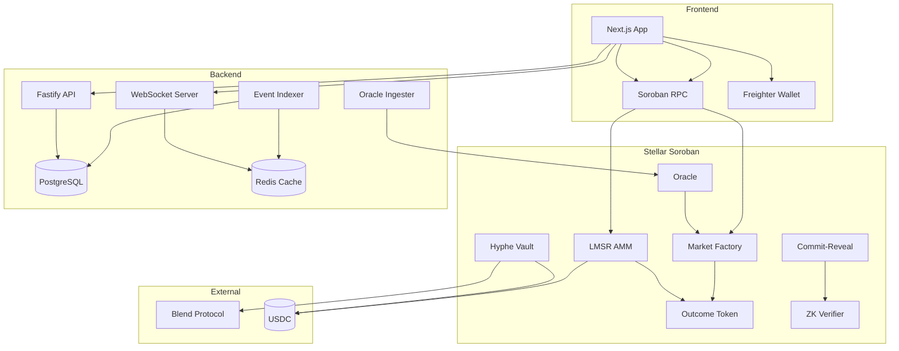

<div align="center">

# HYPHE

### Prediction Markets Meet DeFi Yield on Stellar

[](https://stellar.org)
[](https://soroban.stellar.org)
[](https://nextjs.org)
[](LICENSE)

**Trade on real-world outcomes. Earn yield while you wait.**

Hyphe is an on-chain prediction market protocol where user collateral generates yield through Blend Protocol, creating self-sustaining liquidity - no external subsidies needed.

[Live Demo](#demo) &bull; [Architecture](#architecture) &bull; [Getting Started](#getting-started) &bull; [Contracts](#smart-contracts)

</div>

---

## Table of Contents

- [The Problem](#the-problem)
- [Our Solution](#our-solution)
- [Architecture](#architecture)
- [Features](#features)
- [Smart Contracts](#smart-contracts)
- [Tech Stack](#tech-stack)
- [Getting Started](#getting-started)
- [Project Structure](#project-structure)
- [How It Works](#how-it-works)
- [Roadmap](#roadmap)
- [Acknowledgements](#acknowledgements)
- [License](#license)

---

## The Problem

Prediction markets are powerful tools for information aggregation — Vitalik Buterin calls this **InfoFi** (Information Finance). But they have a fundamental bootstrapping problem first identified by Robin Hanson:

> *Automated market makers require liquidity subsidies to function. Someone has to pay for the information the market produces.*

Platforms like Polymarket solve this with external funding, VC-backed incentives, and high fees. This works at scale but makes it nearly impossible for new markets to launch without deep pockets.

Meanwhile, billions of dollars in prediction market collateral sit idle, generating zero yield.

## Our Solution

**Hyphe makes prediction markets self-sustaining.**

When users deposit USDC to trade, their collateral is automatically routed to [Blend Protocol](https://blend.capital) — Stellar's native lending pool — earning 3-5% APY. This yield is split:

| Allocation | Share | Purpose |
|:-----------|:-----:|:--------|
| Liquidity Subsidy | 70% | Funds the LMSR automated market maker |
| User Rewards | 20% | Returned to depositors as passive yield |
| Protocol | 10% | Sustains development and operations |

The result: **users earn yield while their positions are open**, and the protocol never needs external subsidies to maintain deep liquidity. The market participants themselves fund the information aggregation mechanism through their own invested capital.

---

## Architecture



**Chain-first architecture**: The frontend reads live market state directly from smart contracts via Soroban RPC. The backend serves as an indexer for historical data, trade events, and price snapshots — not as a source of truth.

---

## Features

**Trading**
- Buy and sell outcome tokens (YES/NO) with real USDC
- LMSR automated market maker with instant liquidity at any size
- Real-time price quotes from on-chain AMM (no off-chain orderbook)
- Live odds streaming via WebSocket

**Markets**
- Multi-outcome support (binary and categorical markets)
- Oracle-based resolution with dispute mechanism
- Commit-reveal scheme for private betting
- Geographic market discovery with interactive world map

**Yield**
- Automatic yield generation on all deposited collateral
- Blend Protocol integration (Stellar-native lending)
- 70/20/10 yield distribution (subsidy / users / protocol)

**Privacy**
- ZK proof verification on-chain
- Noir circuits for private bets with Barretenberg proving backend
- Leverages Stellar Protocol 25 native cryptographic primitives

**InfoFi Signals**
- Second-order market intelligence (momentum, whale alerts, odds shifts)
- Real-time signal computation engine
- Public goods data layer for downstream applications

---

## Smart Contracts

Seven Soroban contracts form the protocol core:

| Contract | Description | Key Functions |
|:---------|:------------|:-------------|
| **market_factory** | Creates and manages prediction markets | `create_market`, `resolve`, `split`, `merge`, `redeem` |
| **lmsr_amm** | Logarithmic Market Scoring Rule market maker | `buy`, `sell`, `quote_buy`, `quote_sell`, `get_prices` |
| **outcome_token** | Multi-asset token (ERC-1155-like) for outcome shares | `mint`, `burn`, `balance`, `total_supply` |
| **hyphe_vault** | Manages deposits and yield through Blend | `deposit`, `withdraw`, `accrue`, `claim_yield` |
| **oracle** | Decentralized resolution with dispute mechanism | `submit`, `dispute`, `finalize` |
| **commit_reveal** | Two-phase private betting scheme | `commit`, `reveal` |
| **zk_verifier** | proof verification using BN254 | `verify_proof` |

All contracts use fixed-point arithmetic (18 decimal precision for shares, 7 decimal for USDC) with no floating-point operations.

---

## Tech Stack

| Layer | Technology | Version |
|:------|:-----------|:--------|
| **Smart Contracts** | Rust + Soroban SDK | v25.1.1 |
| **Blockchain** | Stellar Soroban | Protocol 25 |
| **Frontend** | Next.js (App Router) + React | 16.1 / 19.2 |
| **Styling** | Tailwind CSS + shadcn/ui + Radix | v4 |
| **State** | Zustand + TanStack Query | v5.0 / v5.90 |
| **Charts** | Lightweight Charts | v5.1 |
| **Backend** | Fastify + TypeScript | v5.7 |
| **Database** | PostgreSQL + Prisma ORM | 16 / v7.4 |
| **Cache** | Redis | v7 |
| **ZK Circuits** | Noir + Barretenberg | v0.36 |
| **Wallet** | Stellar Wallets Kit | v1.9 |

---

## Getting Started

### Prerequisites

- [Rust](https://rustup.rs/) with `wasm32v1-none` target
- [Soroban CLI](https://soroban.stellar.org/docs/getting-started/setup)
- [Node.js](https://nodejs.org/) >= 20
- [Docker](https://docker.com/) (for PostgreSQL + Redis)
- [Stellar Freighter Wallet](https://freighter.app/) (browser extension)

### 1. Clone the repository

```bash
git clone https://github.com/DavidZapataOh/hyphe-stellar.git
cd hyphe-stellar
```

### 2. Start infrastructure

```bash
docker-compose up -d
```

This starts PostgreSQL (port 5432) and Redis (port 6379).

### 3. Build smart contracts

```bash
cd contracts
cargo build --release --target wasm32v1-none
```

> **Note**: Do not set `CARGO_TARGET_DIR` for WASM builds. The `contractimport` macro expects binaries at `../target/wasm32v1-none/release/`.

### 4. Run contract tests

```bash
cd contracts
CARGO_TARGET_DIR=/tmp/hyphe-target cargo test --workspace
```

### 5. Deploy to testnet

```bash
./scripts/deploy-testnet.sh
```

This builds, optimizes, deploys all 7 contracts, initializes them, and writes addresses to `scripts/testnet-addresses.json`.

### 6. Start the backend

```bash
cd backend
npm install
npx prisma migrate deploy
npx prisma generate
npm run dev
```

The API server starts on `http://localhost:3001` with the event indexer, oracle ingester, and price tracker running as background services.

### 7. Start the frontend

```bash
cd frontend
npm install
npm run dev
```

Open `http://localhost:3000` in your browser. Connect your Freighter wallet to start trading.

---

## Project Structure

```
hyphe/
├── contracts/                 # Soroban smart contracts (Rust)
│   ├── outcome_token/         # Multi-asset outcome shares
│   ├── market_factory/        # Market creation & lifecycle
│   ├── lmsr_amm/              # LMSR automated market maker
│   ├── hyphe_vault/           # Yield vault (Blend integration)
│   ├── oracle/                # Resolution & disputes
│   ├── commit_reveal/         # Private betting
│   └── zk_verifier/           # Groth16 proof verification
│
├── backend/                   # Node.js API & services
│   ├── src/
│   │   ├── routes/            # REST API endpoints
│   │   ├── services/          # Indexer, oracle, price tracker, yield cron
│   │   ├── stellar/           # Contract interaction layer
│   │   └── cache/             # Redis price cache
│   └── prisma/                # Database schema & migrations
│
├── frontend/                  # Next.js web application
│   ├── src/
│   │   ├── app/               # Pages (home, markets, portfolio)
│   │   ├── components/        # UI components
│   │   ├── hooks/             # React hooks (chain reads, trading, quotes)
│   │   ├── lib/stellar/       # Contract bindings, parsers, types
│   │   └── stores/            # Zustand state management
│   └── public/                # Static assets
│
├── scripts/                   # Deployment & initialization
│   ├── deploy-testnet.sh      # Full deployment orchestration
│   └── testnet-addresses.json # Deployed contract addresses
│
└── docker-compose.yml         # PostgreSQL + Redis
```

---

## How It Works

### Trading Flow

```
User deposits $10 USDC to buy YES on "Will Argentina win the World Cup?"
    │
    ├─► USDC transfers to LMSR AMM contract
    ├─► AMM mints YES outcome tokens based on LMSR pricing curve
    ├─► Excess collateral routes to Hyphe Vault → Blend Pool (earning yield)
    └─► User receives YES tokens in their wallet

Later, the user can:
    ├─► Sell tokens back to the AMM at current market price
    ├─► Hold until resolution and redeem at $1 per winning token
    └─► Merge equal YES + NO positions back into USDC (split/merge)
```

### LMSR Pricing

The [Logarithmic Market Scoring Rule](https://mason.gmu.edu/~rhanson/mktscore.pdf) ensures:

- **Instant liquidity** — Every trade executes immediately, no counterparty needed
- **Bounded loss** — The maximum subsidy is `b × ln(n)` where `b` is the liquidity parameter and `n` is the number of outcomes
- **Information aggregation** — Prices converge to true probabilities as informed traders profit from mispricing

### Resolution

Markets are resolved through the oracle contract:

1. **Oracle submits outcome** — Authorized oracle (backed by sports APIs) submits the result
2. **Dispute window** — 2-hour window for anyone to dispute by posting a 1 USDC bond
3. **Finalization** — If undisputed, the result is finalized and winners can redeem at $1 per share

---

## Roadmap

### Now (March 2026)
- [x] 7 smart contracts deployed on Stellar Testnet
- [x] LMSR AMM with real USDC trading (buy + sell)
- [x] Blend Protocol yield integration
- [x] Chain-first frontend (direct contract reads)
- [ ] Oracle ingester with live sports data
- [ ] ZK verifier with Protocol 25 BN254 pairing

### Q2 2026
- [ ] Mainnet launch with audited contracts
- [ ] Mobile App
- [ ] Liquidity-sensitive AMM (dynamic `b` parameter based on volume)
- [ ] Multi-oracle consensus (ChainLink, API3, custom)

### Q3 2026
- [ ] InfoFi API — public endpoints for second-order market signals
- [ ] SDK for third-party market creation
- [ ] Cross-chain collateral (Ethereum USDC via bridge)
- [ ] Governance token and protocol decentralization

---

## Testnet Addresses

| Contract | Network |
|:---------|:--------|
| **USDC** | `CAQCFVLOBK5GIULPNZRGATJJMIZL5BSP7X5YJVMGCPTUEPFM4AVSRCJU` |
| **Blend Pool** | `CCEBVDYM32YNYCVNRXQKDFFPISJJCV557CDZEIRBEE4NCV4KHPQ44HGF` |

All 7 protocol contract addresses are stored in [`scripts/testnet-addresses.json`](scripts/testnet-addresses.json) after deployment.

---

## Acknowledgements

- [Stellar Development Foundation](https://stellar.org) — Soroban smart contract platform
- [Blend Protocol](https://blend.capital) — Stellar-native lending pool enabling endogenous yield
- [Robin Hanson](https://mason.gmu.edu/~rhanson/) — LMSR market scoring rule
- [Vitalik Buterin](https://vitalik.eth.limo/general/2025/01/23/l1l2future.html) — InfoFi framework and prediction market philosophy
- **Build Better Hackathon** — For the deadline pressure that makes great things happen

---

## License

This project is licensed under the MIT License. See [LICENSE](LICENSE) for details.

---

<div align="center">

**Built for the [Build Better Hackathon](https://stellar.org) on Stellar**

*Information wants to be priced.*

</div>
